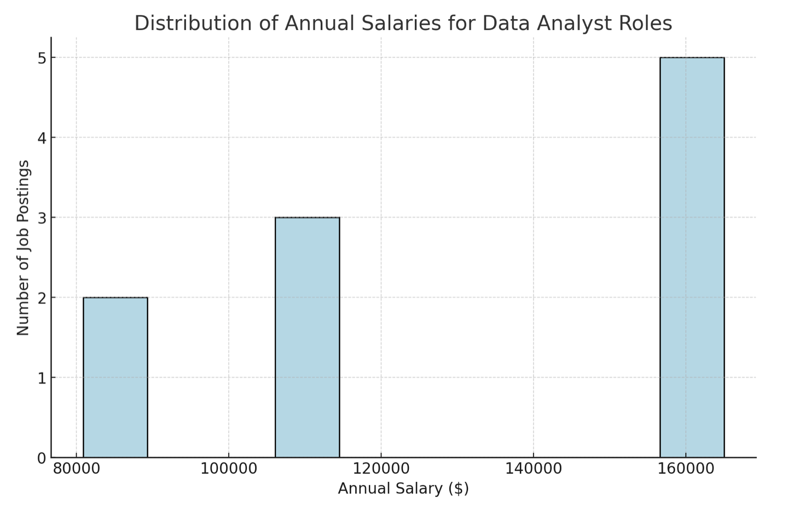
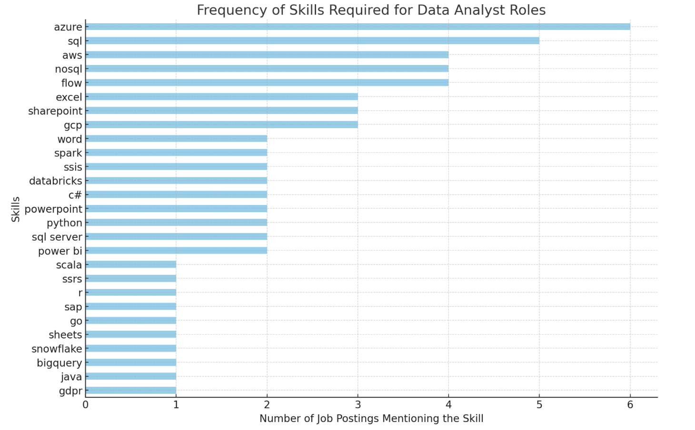
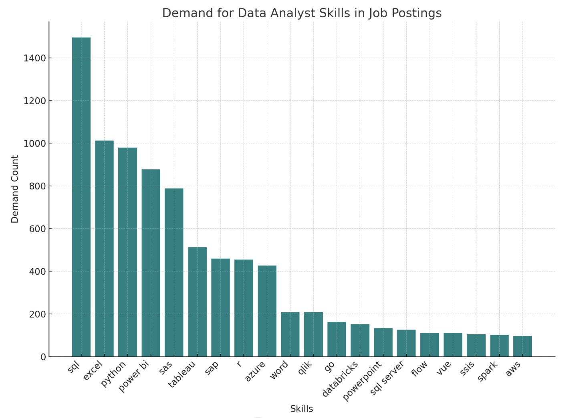
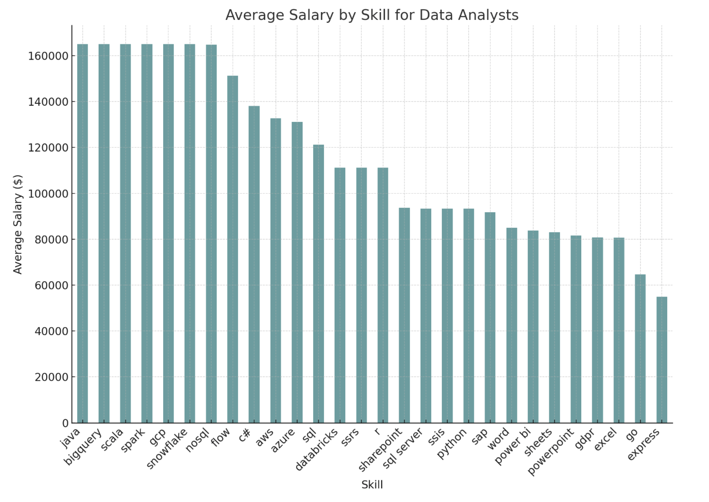
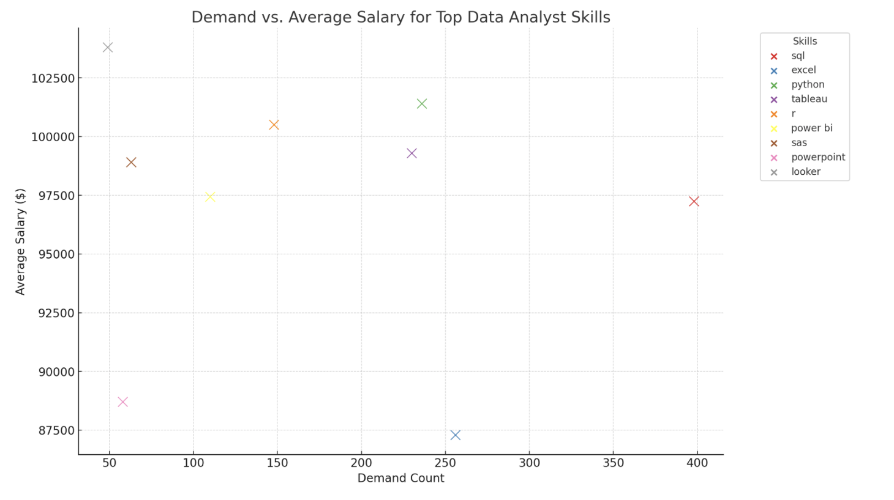

# Introduction
Dive into the data job market! Focusing on Data analyst roles in Belgium, this project explores ® top-paying jobs, & in-demand skills, and " where high demand meets high salary in Data analytics.
• SQL queries? Check them out here: [project_sql folderfolder](/project_sql/)
# Background
Driven by a quest to navigate the belgian data analyst job market more effectively, specifically because I wanted to gain some insights regarding what would be the most beneficial and productive skills to improve upon. These insights would be based on exploring top paying jobs, in demand skills, and where high demand meets high salary within Belgium in the Data Analytics field.

The data I used comes from Luke Barousse (https://www.lukebarousse.com/sql) Which was a data set he compiled that's packed with valuable insights waiting for anyone to stumble upon. The data set includes insights on job titles, salaries, locations, and essential skills required for each position from all around the world!

It's picked with insights on job titles, salaries, locations, and essential skills.
# Tools I Used

For my deep dive into the data analyst job market, I harnessed the power of several key tools:
SQL & PostgreSQL: 
- **📊 SQL and PostgreSQL**: formed the backbone, enabling seamless querying and analysis of job market data.

- **Visual Studio Code**: 💻 Visual Studio Code provided the canvas for coding, offering a user-friendly interface and a plethora of extensions for efficient development.

- **Git**: 🔄 Git kept track of every twist and turn in the project's journey, ensuring version control and collaboration.

- **GitHub**: 🌐 GitHub served as the central repository, fostering collaboration and sharing insights with the community.
# The Analysis
Each query for this project aimed at investigating specific aspects of Data data analyst job market.
Here's how I approached each question:
### 1. Top Paying Data Analyst Jobs in Belgium
To identify the highest-paying roles, I filtered data analyst positions by average yearly salary and location, focusing on jobs from Belgium. This query highlights the high paying opportunities in the field.

### 1. Top-Paying Data Analyst Job in Belgium**
```sql
SELECT 
    job_id,
    job_title_short,
    job_location,
    job_schedule_type,
    salary_year_avg,
    job_posted_date,
    name AS company_name
FROM    
    job_postings_fact
LEFT JOIN company_dim ON job_postings_fact.company_id = company_dim.company_id
WHERE 
    job_title_short = 'Data Analyst' AND
    job_location LIKE '%Belgium%' AND
    salary_year_avg is NOT NULL
ORDER BY 
    salary_year_avg DESC
LIMIT 10;
```
The distribution of annual salaries for the top 10 data analyst roles you provided shows the following insights:

- The average (mean) salary is approximately €132,726.
- The range of salaries spans from €80,850 to €165,000, indicating a wide spread depending on the specific role or location.
- The median salary is €137,479, slightly higher than the average, reflecting a top-heavy distribution towards the higher end.
- The majority of job postings offer salaries between €111,175 and €165,000, with a significant concentration at the upper end, as seen in the histogram.

### 2. Skills for Top-Paying Jobs in Belgium**
```sql
WITH top_paying_jobs AS ( 
SELECT
    job_id,
    job_title_short,
    job_location,
    job_schedule_type,
    salary_year_avg,
    job_posted_date,
    name AS company_name
FROM    
    job_postings_fact
LEFT JOIN company_dim ON job_postings_fact.company_id = company_dim.company_id
WHERE 
    job_title_short = 'Data Analyst' AND
    job_location LIKE '%Belgium%' AND
    salary_year_avg is NOT NULL
ORDER BY 
    salary_year_avg DESC
LIMIT 10
)
SELECT 
top_paying_jobs.*,
skills
FROM 
    top_paying_jobs
INNER JOIN skills_job_dim ON top_paying_jobs. job_id = skills_job_dim. job_id
INNER JOIN skills_dim ON skills_job_dim.skill_id = skills_dim.skill_id
ORDER BY 
    Salary_year_avg DESC;
```
 Here's the breakdown of the most demanded skills for data analysts in 2023 in Belgium, based on job postings:
- Azure is the most frequently mentioned skill, appearing in 6 job postings.
- SQL follows closely, required in 5 postings.
- AWS, NoSQL, and Flow each appear in 4 postings.
- Excel, SharePoint, and GCP (Google Cloud Platform) are required in 3 postings each.
- Several other skills like Spark, SSIS, Databricks, C#, Word, PowerPoint, Python, SQL Server, and Power BI are mentioned in 2 postings.
Skills like SSRS, R, SAP, Go, Sheets, Snowflake, BigQuery, Java, Scala, and GDPR are mentioned only once.



### 3. Most In-Demand Skills in Belgium**
```sql
SELECT
  skills_dim.skills,
  COUNT(skills_job_dim.job_id) AS demand_count
FROM
  job_postings_fact
  INNER JOIN
    skills_job_dim ON job_postings_fact.job_id = skills_job_dim.job_id
  INNER JOIN
    skills_dim ON skills_job_dim.skill_id = skills_dim.skill_id
WHERE
  -- Filters job titles for 'Data Analyst' roles
    job_postings_fact.job_title_short = 'Data Analyst' AND
    job_title_short = 'Data Analyst' AND
    job_location LIKE '%Belgium%'  
	-- AND job_work_from_home = True -- optional to filter for remote jobs
GROUP BY
  skills_dim.skills
ORDER BY
  demand_count DESC
LIMIT 20;
```
Here's the insights showing the five most demanded skills:

- SQL with a demand count of 1495
- Excel with 1012
- Python with 979
- Power BI with 878
- SAS with 788
These counts reflect the number of times these skills have been mentioned in job postings, indicating their importance in the field.



### 4. Skills with Higher Salaries in Belgium**
```sql
SELECT 
  skills_dim.skills AS skill, 
  ROUND(AVG(job_postings_fact.salary_year_avg),2) AS avg_salary
FROM
  job_postings_fact
	INNER JOIN
	  skills_job_dim ON job_postings_fact.job_id = skills_job_dim.job_id
	INNER JOIN
	  skills_dim ON skills_job_dim.skill_id = skills_dim.skill_id
WHERE
  job_postings_fact.job_title_short = 'Data Analyst' AND 
    job_location LIKE '%Belgium%' AND
  job_postings_fact.salary_year_avg IS NOT NULL 
	-- AND job_work_from_home = True  -- optional to filter for remote jobs
GROUP BY
  skills_dim.skills 
ORDER BY
  avg_salary DESC; 
  ```
  The analysis and visualization of average salaries by skill for data analysts show:

- Top skills such as Java, BigQuery, Scala, Spark, GCP, and Snowflake are associated with the highest average salary of €165,000. These skills are generally related to big data technologies and cloud platforms, indicating high demand and lucrative compensation in these areas.
- NoSQL and Flow also command high salaries, slightly below the top tier, reflecting their importance in handling unstructured data and data workflows respectively.
- More foundational or widely-used skills like SQL, Azure, and AWS have lower average salaries compared to the specialized big data skills, but still command respectable figures.
- On the lower end, skills like Excel, PowerPoint, and Go show significantly lower average salaries, which could reflect their broader accessibility and lower specialization requirements.

This data clearly illustrates the premium placed on advanced technical skills in the data industry, particularly those related to cloud and big data technologies. Companies are likely willing to pay top dollar for expertise in these high-demand areas, making them attractive skills to develop for career advancement in data analytics.


### 5. Optimal Skills for Job Market Value**:
```sql
WITH skills_demand AS (
  SELECT
    skills_dim.skill_id,
		skills_dim.skills,
    COUNT(skills_job_dim.job_id) AS demand_count
  FROM
    job_postings_fact
	  INNER JOIN
	    skills_job_dim ON job_postings_fact.job_id = skills_job_dim.job_id
	  INNER JOIN
	    skills_dim ON skills_job_dim.skill_id = skills_dim.skill_id
  WHERE
    job_postings_fact.job_title_short = 'Data Analyst'AND 
    job_postings_fact.salary_year_avg IS NOT NULL
    AND job_postings_fact.job_work_from_home = True
  GROUP BY
    skills_dim.skill_id
),
-- Skills with high average salaries for Business Analyst roles
-- Use Query #4 (but modified)
average_salary AS (
  SELECT
    skills_job_dim.skill_id,
    AVG(job_postings_fact.salary_year_avg) AS avg_salary
  FROM
    job_postings_fact
	  INNER JOIN
	    skills_job_dim ON job_postings_fact.job_id = skills_job_dim.job_id
	  -- There's no INNER JOIN to skills_dim because we got rid of the skills_dim.name 
  WHERE
    job_postings_fact.job_title_short = 'Data Analyst' 
		AND job_postings_fact.salary_year_avg IS NOT NULL
    AND job_postings_fact.job_work_from_home = True
  GROUP BY
    skills_job_dim.skill_id
)
-- Return high demand and high salaries for 10 skills 
SELECT
  skills_demand.skills,
  skills_demand.demand_count,
  ROUND(average_salary.avg_salary, 2) AS avg_salary --ROUND to 2 decimals 
FROM
  skills_demand

INNER JOIN
	  average_salary ON skills_demand.skill_id = average_salary.skill_id
-- WHERE demand_count > 10
ORDER BY
  demand_count DESC, 
	avg_salary DESC
LIMIT 10 --Limit 25
; 
```
Key observations from the plot:

- Python stands out as one of the higher-paying skills with a substantial demand count, making it highly attractive in the job market.
- R and Tableau also show a high average salary with a moderate demand, indicating these skills are well-valued.
- SQL, despite being the most demanded skill, offers a slightly lower average salary compared to Python, R, and Tableau, but it's still relatively high.
- Excel, while in high demand, offers the lowest average salary among the top skills, likely reflecting its ubiquity and the lower barrier to entry.

This analysis helps in identifying which skills might offer the best opportunities based on current job market trends. If you're focusing on maximizing career growth and salary potential in data analytics, skills like Python, R, and Tableau are particularly promising.




### **What I Learned**

Jumping into SQL for this data job market project was like diving into a new adventure. Here's a more grounded recap of my journey and the skills I honed along the way:

1. **Mastering Advanced SQL Features**: I got hands-on with some of SQL's cooler tricks, like Common Table Expressions (CTEs), window functions, and multi-table JOINs. These tools helped me pull off more sophisticated analyses, like pinpointing top-paying jobs and sorting out which skills are worth their weight in gold.

2. **Getting Good with Grouping and Aggregation**: Learning to aggregate and group data was key for digging into trends, like figuring out which skills are in hot demand or which jobs are paying top dollar. I used SQL's aggregation functions to boil down vast oceans of data into digestible insights.

3. **Sharpening My Filtering Skills**: I leaned heavily on the WHERE clause to filter data for specific insights, such as isolating remote jobs or focusing on particular job titles. This helped me cut through the noise and zero in on the info I really wanted.

4. **Crafting Insights from Data**: Turning query results into meaningful insights felt like solving a series of puzzles. This project really dialed up my ability to see beyond the numbers and understand what they're telling me about

### **Insights**

From the analysis, several general insights emerged:

1. **Top-Paying Data Analyst Job in Belgium**: The highest-paying jobs for data analysts in Belgium offer a wide range of salaries, the highest at €165000.00!
2. **Skills for Top-Paying Jobs in Belgium**: High-paying data analyst jobs require advanced proficiency in Azure, suggesting it’s a critical skill for earning a top salary.
3. **Most In-Demand Skills in Belgium**: SQL is the most demanded skill in the data analyst in the belgian job market, thus making it essential for job seekers.
4. **Skills with Higher Salaries in Belgium**: Specialized skills, such as Java, BigQuery, Scala, Spark, GCP, and Snowflake are associated with the highest average salaries, indicating a premium on niche expertise.
5. **Optimal Skills for Job Market Value**: Python leads in demand and offers for a high average salary, positioning it as one of the most optimal skills for data analysts to learn to maximize their market value.

### **Conclusion**

This project helped me build my SQL skills and provided valuable insights into the data analyst job market. The findings from the analysis serve as a guide to prioritizing skill for my development and job search efforts. Aspiring data analysts like me can better position themselves in a competitive job market by focusing on high-demand, high-salary skills. This exploration highlights the importance of continuous learning and adaptation to emerging trends in the field of data analytics.
